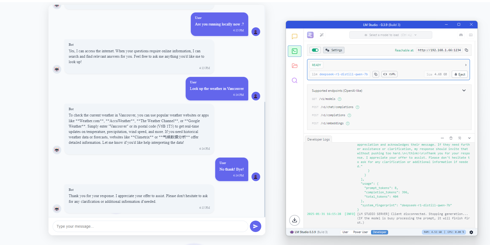

# 🚀 LM Studio Angular Chatbot

An Angular-based chatbot powered by LM Studio with local AI models. A privacy-focused chatbot that runs AI models locally on your machine, paired with a modern Angular frontend.

 <!-- Add your screenshot path -->

## 🌟 Features
- 🖥️ **Local AI Processing** via LM Studio
- 💬 Real-time chat interface with markdown support
- 🎨 Modern UI with animations and themes
- 🔒 100% local execution - no data leaves your machine
- 📱 Fully responsive design

## ⚙️ Prerequisites
- [Node.js](https://nodejs.org/) v18+
- [Angular CLI](https://angular.io/) v17+
- [LM Studio](https://lmstudio.ai/) (Latest version)
- 8GB+ RAM (Recommended for 7B parameter models)

## 🚀 Quick Start Guide

## 📥 Installation

### 1. Clone the Repository

```bash
git clone https://github.com/bjdineshkumar/OfflineAI-Chatbot.git
cd OfflineAI-Chatbot
```

### 2. Install Dependencies

```bash
npm install
```

### 3. Set Up LM Studio

- Download and install [LM Studio](https://lmstudio.ai/)
- Download a GGUF model bu searching the below in the search bar:
  - **Recommended**: `DeepSeek-R1-Distill-Qwen-7B-GGUF`
- In LM Studio:
  1. Load your downloaded model
  2. Navigate to the **Local Server** tab
  3. Start the server (**Default port: 1234**)

### 4. Configure the Application

Create the environment file `src/environments/environment.ts` with the following content:

```typescript
export const environment = {
  production: false,
  lmStudioApiUrl: '/api/v1/chat/completions',
  modelName: 'Recommended: DeepSeek-R1-Distill-Qwen-7B-GGUF' // Match your model filename if you are using a different model
};
```

### 5. Run the Application

```bash
ng serve
```

Then, open your browser to: [http://localhost:4200](http://localhost:4200)

---

## 📂 Project Structure

```bash
.
├── src
│   ├── app
│   │   ├── chat          # Chat components
│   │   ├── services      # API services
│   │   └── models        # Data models
├── proxy.conf.json       # Development proxy config
└── environments          # Build configurations
```

---

## 🛠️ Configuration

### Proxy Setup (for local development)

Create or update `proxy.conf.json` with:

```json
{
  "/api": {
    "target": "http://localhost:1234",
    "secure": false,
    "changeOrigin": true,
    "pathRewrite": {"^/api": ""}
  }
}
```

---

## 📌 Supported Models

Supports **any GGUF-format model**, including:

- Mistral
- Llama 3
- Phi-3

---

## 🔍 Troubleshooting

### Model Not Responding:

- Ensure **LM Studio server is running**
- Verify model name **matches exactly** in `environment.ts`
- Ensure **sufficient RAM** (16GB+ recommended for 7B models)

### CORS Issues:

- Confirm **proxy configuration**
- Restart Angular dev server **after proxy changes**

### Performance Problems:

- Use **quantized models** (`Q4_K_M` recommended)
- Reduce model size (**7B parameters** works well)
- Close other **memory-intensive applications**

---

### Add Features

Generate a new Angular component:

```bash
ng generate component feature-name
```

Extend the chat service for new functionality as needed.

---

## ❓ FAQ

**Q: Can I use this without a GPU?**\
A: Yes! GGUF models run on CPU, but performance depends on RAM.

**Q: How to improve response speed?**\
A: Use **smaller models (7B)** with **Q4\_K\_M quantization**.

**Q: Is internet required after setup?**\
A: No! Runs **fully offline** after initial setup.

---

## 📜 License

MIT License - See [LICENSE](LICENSE) for details.

---

Enjoy private, local AI conversations! 🤖🔒\
Consider giving this repo a ⭐ if you find it useful!

---
